# DevSecOps .NET GitHub Actions Sample

[](https://github.com/mehdihadeli/dotnet-github-actions-pipeline/actions/workflows/ci.yaml)
[](https://github.com/mehdihadeli/dotnet-github-actions-pipeline/actions/workflows/cd.yaml)


Practical .NET 10 DevSecOps sample that shows how to build a security-first GitHub Actions platform with repo-local composite actions, split CI/CD workflows, supply-chain hardening, machine-readable promotion evidence, and staged post-deploy verification.

This repository is not trying to hide the interesting parts behind opaque reusable workflows. The implementation stays visible in source, while repeated workflow glue is extracted into small local composite actions that are easy to inspect.

## 🎯 Why this repo exists

Many sample pipelines stop at `restore`, `build`, `test`, and one scanner. This sample goes further and keeps the boundaries explicit:

- quality validation before expensive stages
- separate SAST, app SCA, image SCA, and deployment-time checks
- explicit security gate before image publication
- signed and verified artifacts before deployment
- CI evidence passed into CD as machine-readable promotion context
- post-deploy ZAP validation after staged deployment

## ✨ At a glance

| Area                     | What this sample demonstrates                                                                   |
| ------------------------ | ----------------------------------------------------------------------------------------------- |
| Workflow design          | Separate `CI` and `CD` workflows with stage-oriented job naming and least-privilege permissions |
| Quality gates            | Formatting, warnings-as-errors style build, Roslyn analyzers, Gitleaks, Dockerfile lint         |
| SAST                     | Semgrep, Checkov, CodeQL, optional Sonar                                                        |
| SCA and SBOM             | Trivy, Grype, optional Snyk, CycloneDX app SBOM, Syft image SBOM                                |
| Supply chain             | GHCR publish, keyless Cosign signing, signature verification, GitHub attestations               |
| Promotion control        | Central security gate plus `ci-evidence` bundle with deployment intent                          |
| Post-deploy verification | Re-verify signed image in CD, then run ZAP baseline against staged runtime                      |

## 🧭 Quick navigation

| Start here                                             | Description                                 |
| ------------------------------------------------------ | ------------------------------------------- |
| [docs/index.md](docs/index.md)                         | Documentation landing page                  |
| [docs/architecture.md](docs/architecture.md)           | Architecture and trust-boundary overview    |
| [docs/ci-cd-pipeline.md](docs/ci-cd-pipeline.md)       | Full CI/CD walkthrough                      |
| [docs/security-config.md](docs/security-config.md)     | Security tools, policies, and configuration |
| [docs/github-secrets.md](docs/github-secrets.md)       | Required and optional secrets and variables |
| [docs/project-structure.md](docs/project-structure.md) | Repository map                              |
| [docs/api-reference.md](docs/api-reference.md)         | API surface                                 |
| [docs/troubleshooting.md](docs/troubleshooting.md)     | Common failure and recovery paths           |

## 🏗️ Architecture

```mermaid
flowchart LR
  Dev[Developer Push or PR] --> CI[CI Workflow]
  CI --> Q[Quality Gates]
  Q --> SAST[SAST and IaC Scans]
  SAST --> BT[Build and Test]
  BT --> APP[App Security and App SBOM]
  APP --> IMG[Image Build and Image Security]
  IMG --> GATE[Security Gate]
  GATE --> PUB[Publish Sign Verify Attest]
  PUB --> EVIDENCE[CI Evidence Bundle]
  EVIDENCE --> CD[CD Workflow]
  CD --> VERIFY[Verify Signed Image]
  VERIFY --> DEPLOY[Deploy to Staged Runtime]
  DEPLOY --> ZAP[ZAP Baseline]
  ZAP --> REPORT[Deployment Evidence]
```



CI flow:

```text
Source -> Quality Gates -> SAST -> Build/Test -> App Security -> Image Build -> Image Security -> Security Gate -> Publish/Sign/Attest -> Evidence
```

CD flow:

```text
CI Evidence -> Verify Signed Image -> Deploy -> ZAP Baseline -> Deployment Evidence
```

## 🚀 Quick start

### Prerequisites

- .NET 10 SDK
- Docker Desktop or Docker Engine
- Git

### 1. Clone and bootstrap

```bash
dotnet tool restore
dotnet husky install
SOLUTION_PATH=DevSecOpsPipelineSample.slnx dotnet tool run husky -- run --name setup-solution-restore
```

### 2. Run local validation

```bash
dotnet test --solution DevSecOpsPipelineSample.slnx
docker build -t devsecops-pipeline-sample .
```

### 3. Run the workflows

- push or open a pull request to execute CI automatically
- use `workflow_dispatch` when you want to override `sonar_enabled` or `publish_image`
- let `cd.yaml` promote only from successful `CI` runs that emitted valid `ci-evidence`

## 🧩 Core capabilities

### CI and CD model

- `ci.yaml` owns validation, app and image security, publication, signing, attestation, and CI evidence generation
- `cd.yaml` consumes CI evidence, re-verifies the signed image, deploys to a staged runtime, and runs DAST
- stage names are human-readable so run history is easy to scan in GitHub Actions

### Reusable workflow building blocks

- small repo-local composite actions keep repeated glue centralized without hiding behavior
- shared metadata, SARIF upload, GHCR login, Cosign setup, image signing, and CI evidence assembly live under `.github/actions/`
- each local action is intentionally narrow enough to inspect quickly in source

### Security posture

- application and container image are treated as separate security surfaces
- app and image BOMs are generated, persisted, and uploaded separately
- image publishing only happens after the central security gate passes
- CI and CD both participate in supply-chain trust, not only the publish stage

## 📚 Documentation

- [Documentation Index](docs/index.md)
- [Architecture Overview](docs/architecture.md)
- [CI/CD Pipeline Guide](docs/ci-cd-pipeline.md)
- [Security Configuration](docs/security-config.md)
- [GitHub Secrets and Variables](docs/github-secrets.md)
- [Project Structure](docs/project-structure.md)
- [API Reference](docs/api-reference.md)
- [Troubleshooting](docs/troubleshooting.md)

## 🗂️ Repository structure

| Path                                             | Purpose                                                                                                                                     |
| ------------------------------------------------ | ------------------------------------------------------------------------------------------------------------------------------------------- |
| `.github/actions/setup`                          | Restore SDK, tools, and solution dependencies                                                                                               |
| `.github/actions/format`                         | Run `dotnet format` validation                                                                                                              |
| `.github/actions/style`                          | Run warning-as-error build validation                                                                                                       |
| `.github/actions/analyzers`                      | Run Roslyn analyzers explicitly                                                                                                             |
| `.github/actions/build`                          | Build solution in Release mode                                                                                                              |
| `.github/actions/test`                           | Run tests, TRX, native Microsoft Testing Platform `.coverage`, converted Cobertura output, and optional coverage reporting/Coveralls upload |
| `.github/actions/checkout-code`                  | Shared checkout wrapper with optional fetch-depth control                                                                                   |
| `.github/actions/upload-sarif`                   | Shared SARIF upload wrapper for GitHub code scanning                                                                                        |
| `.github/actions/resolve-snyk-config`            | Central Snyk app and image scan enablement logic                                                                                            |
| `.github/actions/resolve-snyk-iac-config`        | Central Snyk IaC enablement logic                                                                                                           |
| `.github/actions/resolve-snyk-monitor-metadata`  | Shared Snyk `target-reference` and `project-tags` resolver                                                                                  |
| `.github/actions/resolve-version-metadata`       | Shared build version and image tag resolver; uses tag name for tagged builds, otherwise short SHA                                           |
| `.github/actions/setup-cosign`                   | Pinned Cosign installer wrapper                                                                                                             |
| `.github/actions/sign-keyless-blob`              | Reusable Cosign blob signing wrapper for SBOM bundles                                                                                       |
| `.github/actions/verify-keyless-blob-signature`  | Reusable Cosign blob verification wrapper for SBOM bundles                                                                                  |
| `.github/actions/login-ghcr`                     | Shared GHCR login wrapper                                                                                                                   |
| `.github/actions/sign-published-image`           | Attach image SBOM and sign published image by digest                                                                                        |
| `.github/actions/verify-keyless-image-signature` | Verify published image keyless signature by digest                                                                                          |
| `.github/actions/create-ci-evidence`             | Generate CI evidence summary and machine-readable deployment metadata                                                                       |
| `.github/actions/download-ci-evidence-artifacts` | Restore the standard CI evidence bundle layout in `record-and-notify`                                                                       |
| `.github/actions/publish`                        | Build and optionally push Docker image                                                                                                      |
| `.github/actions/upload-dependency-track-bom`    | Reusable CycloneDX BOM upload action for Dependency-Track                                                                                   |
| `.github/workflows/ci.yaml`                      | CI workflow for quality, SAST, app and image SCA, BOM upload, signing, and attestation                                                      |
| `.github/workflows/cd.yaml`                      | CD workflow for deployment, post-deploy verification, and ZAP                                                                               |
| `docs`                                           | Project documentation set for architecture, pipeline behavior, security, configuration, API surface, and troubleshooting                    |
| `deployments/dependency-track`                   | Local Dependency-Track + PostgreSQL + Trivy server stack with optional API bootstrap script                                                 |

## 🛠️ Pipeline stages and job map

### CI workflow

| Stage   | Job                       | Purpose                                                                                                                                                                                            |
| ------- | ------------------------- | -------------------------------------------------------------------------------------------------------------------------------------------------------------------------------------------------- |
| Stage 1 | `quality-check`           | Format, style, analyzers, Gitleaks secret scan, Dockerfile lint                                                                                                                                    |
| Stage 2 | `sast-semgrep`            | Fast Semgrep SAST gate after quality validation                                                                                                                                                    |
| Stage 2 | `sast-iac-checkov`        | Checkov scans GitHub Actions, Dockerfile, and secrets-style IaC and pipeline config, with optional Snyk IaC overlay and monitor                                                                    |
| Stage 2 | `sast-codeql`             | Deep CodeQL semantic analysis for C#                                                                                                                                                               |
| Stage 2 | `sast-sonar`              | Optional Sonar analysis with its own restore, build, test, and coverage-import flow                                                                                                                |
| Stage 3 | `dotnet-build-test`       | Build, test, and publish Microsoft Testing Platform `.coverage`, Cobertura, HTML, Markdown, lcov, and optional Coveralls data                                                                      |
| Stage 4 | `dotnet-app-sca-security` | Publish the application scan surface, sign and verify the CycloneDX app SBOM, run blocking Trivy, advisory Grype, optional blocking Snyk overlay, and upload the BOM to Dependency-Track           |
| Stage 5 | `image-build`             | Resolve shared version metadata, build the image once, and export the immutable image artifact                                                                                                     |
| Stage 6 | `image-sca-security`      | Restore the image artifact, generate and verify the image SBOM, run blocking Trivy plus advisory Grype, run optional blocking Snyk container overlay, and upload the image BOM to Dependency-Track |
| Stage 7 | `security-gate`           | Central pass and fail enforcement across Sonar, app security, and image security                                                                                                                   |
| Stage 8 | `image-publish`           | Optional GHCR publish on `main`, tags, or manual dispatch with `publish_image=true`                                                                                                                |
| Stage 8 | `image-sign`              | Attach the image SBOM and sign the published image by digest with GitHub OIDC                                                                                                                      |
| Stage 8 | `verify-image-signature`  | Verify the published image keyless signature before promotion evidence is finalized                                                                                                                |
| Stage 8 | `attest`                  | Publish GitHub build provenance attestation for the signed image                                                                                                                                   |
| Stage 9 | `record-and-notify`       | Collect CI evidence artifacts, build summary metadata, upload a `ci-evidence` bundle, and comment on pull requests                                                                                 |

### CD workflow

| Stage   | Job                      | Purpose                                                                                                       |
| ------- | ------------------------ | ------------------------------------------------------------------------------------------------------------- |
| Stage 1 | `prepare-deployment`     | Download `ci-evidence`, inspect machine-readable deployment metadata, and decide whether promotion is allowed |
| Stage 2 | `verify-image-signature` | Re-verify the CI-signed image at promotion time                                                               |
| Stage 3 | `deploy`                 | Log in to Azure and update Azure Container Apps with the verified image digest                                |
| Stage 4 | `zap-baseline`           | Run staged passive DAST against the resolved staged endpoint                                                  |
| Stage 5 | `record-and-notify`      | Persist deployment evidence and summary output for the promotion run                                          |

## 🛡️ Security outputs and integrations

### GitHub Security tab

| Source      | Upload behavior                               |
| ----------- | --------------------------------------------- |
| CodeQL      | Uploads directly to GitHub Security tab       |
| Semgrep     | SARIF uploads to GitHub Security tab          |
| Checkov     | SARIF uploads to GitHub Security tab          |
| Trivy app   | SARIF uploads to GitHub Security tab          |
| Grype app   | SARIF uploads to GitHub Security tab          |
| Snyk app    | SARIF uploads when `SNYK_TOKEN` is configured |
| Trivy image | SARIF uploads to GitHub Security tab          |
| Grype image | SARIF uploads to GitHub Security tab          |
| Snyk image  | SARIF uploads when `SNYK_TOKEN` is configured |

CodeQL, Semgrep, Trivy, and Grype all surface findings in GitHub code scanning. Semgrep and Trivy remain the blocking CI gates in this sample.

### Dependency-Track BOM uploads

The sample uploads both generated CycloneDX BOMs to Dependency-Track through the reusable action at `.github/actions/upload-dependency-track-bom/action.yml`.

| Surface | CI call site                                                     | BOM file                              | Project name                     | Project version                                                      |
| ------- | ---------------------------------------------------------------- | ------------------------------------- | -------------------------------- | -------------------------------------------------------------------- |
| App     | `dotnet-app-sca-security -> Upload app SBOM to Dependency-Track` | `artifacts/sbom/app/bom.json`         | `${APP_SBOM_PROJECT_NAME}`       | Shared build version from `.github/actions/resolve-version-metadata` |
| Image   | `image-sca-security -> Upload image SBOM to Dependency-Track`    | `artifacts/sbom/image/image.cdx.json` | `${APP_SBOM_PROJECT_NAME}-image` | Shared build version from `image-build`                              |

Version rule:

| Build type    | Version value    |
| ------------- | ---------------- |
| Tagged build  | Git tag name     |
| Non-tag build | Short commit SHA |

Both uploads are gated only by whether `DEPENDENCY_TRACK_URL` and `DEPENDENCY_TRACK_API_KEY` are configured. If either one is missing, the action logs a skip and CI continues.

For local Dependency-Track experiments, see `deployments/dependency-track/`.

## 👨‍💻 Developer workflow

### Local hooks and validation

| Area           | Behavior                                                                                                   |
| -------------- | ---------------------------------------------------------------------------------------------------------- |
| Hook framework | Husky.Net installed as a local dotnet tool under `.husky/`                                                 |
| `pre-commit`   | Runs fast formatting checks only                                                                           |
| `pre-push`     | Runs Gitleaks in Docker plus analyzers, a local Release build that can restore if needed, and tests        |
| Local Gitleaks | Uses `zricethezav/gitleaks:latest` so developers do not need a machine-level binary install                |
| Docker missing | Pre-push fails with a targeted message before blocking the push                                            |
| Hook strategy  | Secret scanning runs on `pre-push` instead of `pre-commit` to keep commit latency low                      |
| Build commands | Husky `build` is local and allows restore; Husky `build-ci` assumes CI setup already restored dependencies |
| CI behavior    | CI keeps Gitleaks enforcement and disables Husky execution with `HUSKY=0`                                  |
| Coverage       | CI test stage also generates a downloadable HTML coverage artifact and markdown summary                    |

Local setup after clone:

```bash
dotnet tool restore
dotnet husky install
SOLUTION_PATH=DevSecOpsPipelineSample.slnx dotnet tool run husky -- run --name setup-solution-restore
```

### Local validation commands

```bash
dotnet test --solution DevSecOpsPipelineSample.slnx
docker build -t devsecops-pipeline-sample .
```

## ⚙️ Configuration

### GitHub secrets and workflow inputs

CI image publish/sign flows use the repository-scoped `GITHUB_TOKEN` for GHCR and do not require a separate `GHCR_TOKEN` secret.

`cd.yaml` deployment expects:

| Required deployment secrets | Purpose               |
| --------------------------- | --------------------- |
| `AZURE_CLIENT_ID`           | Azure OIDC client ID  |
| `AZURE_TENANT_ID`           | Azure tenant ID       |
| `AZURE_SUBSCRIPTION_ID`     | Azure subscription ID |

Optional integration secrets:

| Optional integration secret | Purpose                                                                     |
| --------------------------- | --------------------------------------------------------------------------- |
| `DEPENDENCY_TRACK_URL`      | Enable Dependency-Track BOM uploads                                         |
| `DEPENDENCY_TRACK_API_KEY`  | Authenticate Dependency-Track BOM uploads                                   |
| `GITLEAKS_LICENSE`          | Needed when running Gitleaks in an organization-owned GitHub repository     |
| `SONAR_PROJECT_KEY`         | Enable Sonar analysis                                                       |
| `SONAR_ORGANIZATION`        | SonarCloud organization                                                     |
| `SONAR_HOST_URL`            | Self-hosted SonarQube URL; defaults to `https://sonarcloud.io` when omitted |
| `SNYK_TOKEN`                | Enable managed Snyk overlay scans                                           |
| `SONAR_TOKEN`               | Authenticate Sonar analysis                                                 |

Optional repository variables:

| Optional variable        | Purpose                                                                                                |
| ------------------------ | ------------------------------------------------------------------------------------------------------ |
| `SONAR_CI_ENABLED=false` | Disable Sonar analysis by default for CI runs; when unset, CI-based Sonar analysis defaults to enabled |

Optional manual workflow input:

| Manual input    | Purpose                                                                                               |
| --------------- | ----------------------------------------------------------------------------------------------------- |
| `sonar_enabled` | `workflow_dispatch` input; defaults to `true` and disables Sonar only for that manual run             |
| `publish_image` | `workflow_dispatch` input; defaults to `false` and opts into publish/sign/attest from a manual CI run |

Cosign keyless signing uses GitHub OIDC and does not require a private signing key secret.

### Azure deployment configuration

CD workflow is triggered from a successful CI `workflow_run` and updates an existing Azure Container App by reading GitHub environment-scoped configuration. Provide:

| Deployment setting                         | Purpose                                                                                             |
| ------------------------------------------ | --------------------------------------------------------------------------------------------------- |
| Environment names such as `dev` and `prod` | Keep deployment configuration separated by environment                                              |
| `AZURE_RESOURCE_GROUP`                     | Target resource group                                                                               |
| `CONTAINER_APP_NAME`                       | Target Azure Container App                                                                          |
| `STAGED_API_URL`                           | Optional override if ZAP should scan a specific public endpoint instead of the resolved ingress URL |

Promotion only proceeds when the CI `ci-evidence` bundle indicates auto-deploy is enabled and includes a signed or verified image digest plus a target environment.

This sample keeps deployment generic on purpose. It demonstrates reusable workflow shape and local composite action layout without hard-coding project-specific infrastructure.

## 🧠 Design notes

### Supply chain hardening

| Control                             | Reason                                                                                              |
| ----------------------------------- | --------------------------------------------------------------------------------------------------- |
| Pinned external GitHub Actions      | Reduce supply-chain drift in workflows and composite actions                                        |
| Semgrep from pinned container image | Avoid deprecated wrapper usage                                                                      |
| Checkov                             | Add IaC and pipeline misconfiguration coverage for GitHub Actions and Dockerfile surfaces           |
| Optional Sonar                      | Support teams already using SonarCloud or SonarQube quality gates                                   |
| Trivy and Grype                     | Combine primary blocking scanner with advisory second opinion                                       |
| Snyk CLI-driven scans               | Add optional managed overlay against restored NuGet assets                                          |
| Syft SBOM generation                | Generate runtime-oriented image SBOMs                                                               |
| ReportGenerator and Coveralls       | Produce local and external coverage outputs                                                         |
| Cosign keyless signing              | Sign app SBOMs, image SBOMs, published images, and deploy-time verification checks with GitHub OIDC |
| ZAP baseline                        | Add staged passive DAST after deployment                                                            |

### Tooling choices

| Tool or choice                      | Why it is here                                                                                                |
| ----------------------------------- | ------------------------------------------------------------------------------------------------------------- |
| CodeQL                              | Adds deeper semantic analysis and GitHub-native code scanning for C#                                          |
| Sonar                               | Adds broader quality-gate and hotspot analysis, but does not replace CodeQL or Semgrep                        |
| Checkov                             | Covers workflow and container IaC misconfiguration gaps that SAST and SCA do not cover well                   |
| Semgrep                             | Adds fast SAST coverage and fits CI gating well for app code and Dockerfile checks                            |
| Gitleaks                            | Adds dedicated secret detection beyond general-purpose filesystem scanners                                    |
| Trivy and Grype                     | Sit in the SCA layer here, even though Trivy also contributes misconfiguration and secret findings            |
| Optional Snyk                       | Adds policy controls and a second managed vulnerability data source when `SNYK_TOKEN` is available            |
| CycloneDX app SBOM                  | Gives stronger NuGet provenance than image-first tooling                                                      |
| Syft image SBOM                     | Better fit for runtime layers and OS packages                                                                 |
| Trivy as primary, Grype as advisory | Keeps one blocking scanner with a useful second opinion                                                       |
| Cosign verification before deploy   | Reduces trust-on-first-use risk for published images                                                          |
| ZAP baseline                        | Intentionally light-weight passive DAST; deeper authenticated DAST should live in a richer staged environment |
