# DevSecOps .NET GitHub Actions Sample

**Security-first .NET 10 CI/CD pipeline with target-environment verification, signed artifacts, SBOM generation, and promotion evidence.**

[](https://github.com/mehdihadeli/dotnet-github-actions-pipeline/actions/workflows/ci.yaml)
[](https://github.com/mehdihadeli/dotnet-github-actions-pipeline/actions/workflows/cd.yaml)


> Practical DevSecOps sample that keeps implementation visible in source instead of hiding it behind opaque reusable workflows. Repeated workflow glue is extracted into small repo-local composite actions, while core validation, security, signing, and deployment logic stays easy to inspect.

Perfect for: platform engineers, DevOps teams, .NET developers, and security-minded teams building GitHub Actions pipelines with explicit quality and trust boundaries.

## 🎯 Overview

This repository demonstrates a security-first .NET delivery pipeline with real CI/CD concerns wired together end to end:

- **Workflow Design**: Separate CI and CD workflows with stage-oriented job boundaries
- **Quality Gates**: Formatting, warning-as-error builds, analyzers, Dockerfile linting, and secret scanning
- **SAST**: Semgrep, Checkov, CodeQL, and optional Sonar analysis
- **SCA and SBOM**: Trivy, Grype, optional Snyk, CycloneDX app SBOM, and Syft image SBOM
- **Supply Chain Controls**: GHCR publish, keyless Cosign signing, signature verification, and GitHub attestations
- **Promotion Evidence**: Machine-readable CI evidence handed from CI into CD with environment routing
- **Deployment Targets**: Config-driven Azure Container Apps, AKS direct deploy, or AKS plus Flux manifest promotion
- **Deployment Verification**: Signed image verification before deploy plus post-deploy smoke, k6, and ZAP validation

## 🧭 Quick Navigation

- [Documentation Index](docs/index.md)
- [Architecture Overview](docs/architecture.md)
- [CI/CD Pipeline Guide](docs/ci-cd-pipeline.md)
- [Security Configuration](docs/security-config.md)
- [GitHub Secrets and Variables](docs/github-secrets.md)
- [Project Structure](docs/project-structure.md)
- [API Reference](docs/api-reference.md)
- [Troubleshooting Guide](docs/troubleshooting.md)

## 🏗️ Architecture

```mermaid
flowchart LR
  Dev[Developer Push or PR] --> CI[CI Workflow]
  CI --> Q[Quality Gates]
  Q --> SAST[SAST and IaC Scans]
  SAST --> BT[Build and Test]
  BT --> APP[App Security and App SBOM]
  APP --> IMG[Image Build and Image Security]
  IMG --> GATE[Central Security Gate]
  GATE --> PUB[Publish Sign Verify Attest]
  PUB --> EVIDENCE[CI Evidence Bundle]
  EVIDENCE --> CD[CD Workflow]
  CD --> VERIFY[Verify Signed Image]
  VERIFY --> DEV[Deploy to Dev]
  VERIFY --> STAGE[Deploy to Staging]
  DEV --> DEVRUNTIME[Dev Smoke + k6 + ZAP]
  DEVRUNTIME --> REPORT[Deployment Evidence]
  STAGE --> STAGERUNTIME[Staging Smoke + k6 + ZAP]
  STAGERUNTIME --> APPROVAL[Manual Approval for Production]
  APPROVAL --> PROD[Deploy to Production]
  PROD --> PRODRUNTIME[Prod Smoke + k6 + ZAP]
  PRODRUNTIME --> REPORT
```



### Pipeline Flow

```text
Developer -> Pull Request or Push -> CI Workflow -> Security Gate -> Signed Image + Evidence -> CD Workflow -> Verify -> Dev deploy or Staging deploy -> Dev ends after runtime checks, Staging continues through manual production approval -> Production deploy -> Prod Smoke + k6 + ZAP -> Deployment Evidence
```

## 🚀 Quick Start

### Prerequisites

- .NET 10 SDK
- Docker Desktop or Docker Engine
- Git
- Access to GitHub Actions if you want to exercise CI/CD remotely
- Azure credentials and environment configuration only if you want to exercise deployment

### 1. Clone and bootstrap

```bash
git clone https://github.com/mehdihadeli/dotnet-github-actions-pipeline.git
cd dotnet-github-actions-pipeline

dotnet tool restore
dotnet husky install
SOLUTION_PATH=DevSecOpsPipelineSample.slnx dotnet tool run husky -- run --name setup-solution-restore
```

### 2. Run local validation

```bash
dotnet test --solution DevSecOpsPipelineSample.slnx
docker build -t devsecops-pipeline-sample .
```

### 3. Run CI and CD

- Push a branch or open a pull request to run CI automatically
- Use `workflow_dispatch` when you want to override `sonar_enabled`
- Merges to `main` emit CI evidence for `dev` deployment
- Tags emit CI evidence for `staging` deployment
- Let `cd.yaml` promote only successful CI runs that emitted valid `ci-evidence`
- Configure the GitHub `production` environment with required reviewers if you want a manual gate before production deployment

### 4. Optional local security integration

If you want to test BOM upload and vulnerability management locally, use the Dependency-Track stack under `deployments/dependency-track/`.

## 📋 Implementation Phases

### ✅ Phase 1: Developer Validation

- Local tool bootstrap with dotnet tools and Husky
- Fast pre-commit formatting checks
- Pre-push build, test, analyzer, and Gitleaks enforcement

### ✅ Phase 2: Quality Gates

- `dotnet format` validation
- Warning-as-error style build checks
- Explicit Roslyn analyzer execution
- Dockerfile linting and secret detection

### ✅ Phase 3: SAST and IaC Analysis

- Semgrep for fast application and config scanning
- Checkov for GitHub Actions, Dockerfile, and IaC-style misconfiguration coverage
- CodeQL for deeper semantic analysis
- Optional SonarCloud or SonarQube analysis

### ✅ Phase 4: Build, Test, and Coverage

- Release build and test execution
- TRX, Microsoft Testing Platform coverage, Cobertura, HTML, Markdown, and lcov outputs
- Optional Coveralls publishing

### ✅ Phase 5: Application Security and SBOM

- CycloneDX application SBOM generation
- Blocking Trivy app scan
- Advisory Grype scan
- Optional Snyk overlay scan
- Optional Dependency-Track BOM upload

### ✅ Phase 6: Container Build and Image Security

- Immutable image build artifact generation
- Syft image SBOM generation
- Blocking Trivy image scan
- Advisory Grype image scan
- Optional Snyk container overlay

### ✅ Phase 7: Security Gate and Promotion Control

- Central pass or fail evaluation across app and image security stages
- Publish only after security gate success
- CI evidence bundle creation for downstream promotion decisions

### ✅ Phase 8: Supply Chain Trust

- GHCR image publish
- Keyless Cosign signing for SBOMs and images
- Signature verification by digest
- GitHub build provenance attestation

### ✅ Phase 9: Deployment and Runtime Verification

- CI-to-CD promotion through `workflow_run`
- Image signature re-verification before deploy
- Main branch auto-routes to `dev`
- Tag push auto-routes to `staging`
- Production promotion uses a manual GitHub Environment gate after successful staging runtime validation
- Config-driven deploy target selection: Azure Container Apps, AKS direct, or AKS plus Flux
- Smoke, k6, and ZAP validation against the deployed runtime
- Deployment evidence recording

## 🛡️ Security Features

### Vulnerability Scanning

- **Semgrep** for fast SAST coverage
- **Checkov** for workflow, Dockerfile, and IaC-style checks
- **CodeQL** for GitHub-native semantic code scanning
- **Trivy** as the primary blocking app and image scanner
- **Grype** as advisory second-opinion app and image scanning
- **Snyk** as optional managed overlay when `SNYK_TOKEN` is configured

### Supply Chain Hardening

- **CycloneDX** for application SBOM generation
- **Syft** for runtime-oriented image SBOM generation
- **Cosign keyless signing** using GitHub OIDC
- **Digest-based verification** before promotion and before deployment
- **GitHub attestations** for build provenance

### Policy and Audit Controls

```yaml
security-model:
  quality-gates: required
  app-scan-blocking: trivy
  image-scan-blocking: trivy
  advisory-scanners:
    - grype
    - snyk-optional
  signing: cosign-keyless
  promotion-evidence: required
  deploy-time-verification: required
```

### Security Outputs

- SARIF uploads to the GitHub Security tab from Semgrep, Checkov, Trivy, Grype, and optional Snyk
- Separate app and image SBOM artifacts
- Machine-readable CI evidence for CD decisions
- Deployment-time evidence after target-environment verification and DAST

## 🔧 Configuration

### Required deployment secrets

- `AZURE_CLIENT_ID`
- `AZURE_TENANT_ID`
- `AZURE_SUBSCRIPTION_ID`

### Optional integration secrets

- `DEPENDENCY_TRACK_URL`
- `DEPENDENCY_TRACK_API_KEY`
- `GITLEAKS_LICENSE`
- `SONAR_PROJECT_KEY`
- `SONAR_ORGANIZATION`
- `SONAR_HOST_URL`
- `SONAR_TOKEN`
- `SNYK_TOKEN`

### Optional repository variable

- `SONAR_CI_ENABLED=false` to disable Sonar by default for CI runs

### Optional manual workflow inputs

- `sonar_enabled` to disable Sonar only for one manual run

### Deployment target settings

| Variable                     | Scope                | Required when           | Notes                                     |
| ---------------------------- | -------------------- | ----------------------- | ----------------------------------------- |
| `DEPLOY_TARGET`              | shared               | always                  | `aca` or `aks`                            |
| `TARGET_API_URL`             | shared               | optional                | published URL override for smoke, k6, ZAP |
| `AZURE_RESOURCE_GROUP`       | environment-specific | `DEPLOY_TARGET=aca`     | ACA resource group                        |
| `CONTAINER_APP_NAME`         | environment-specific | `DEPLOY_TARGET=aca`     | ACA app name                              |
| `AKS_DEPLOY_MODE`            | shared               | `DEPLOY_TARGET=aks`     | `direct` or `flux`                        |
| `AKS_RESOURCE_GROUP`         | environment-specific | `DEPLOY_TARGET=aks`     | AKS cluster resource group                |
| `AKS_CLUSTER_NAME`           | environment-specific | `DEPLOY_TARGET=aks`     | AKS cluster name                          |
| `AKS_TARGET_API_URL`         | environment-specific | optional for AKS        | falls back to `TARGET_API_URL`            |
| `AKS_MANIFESTS_PATH`         | shared               | direct AKS              | manifest root for `Azure/k8s-deploy`      |
| `AKS_NAMESPACE`              | shared               | optional for direct AKS | defaults to `default`                     |
| `AKS_ROLLOUT_TIMEOUT`        | shared               | optional for direct AKS | uses action default when unset            |
| `AKS_FLUX_GITOPS_REPOSITORY` | shared               | Flux AKS                | GitOps repo                               |
| `AKS_FLUX_GITOPS_BRANCH`     | shared               | optional for Flux AKS   | defaults to `main`                        |
| `AKS_FLUX_MANIFEST_PATH`     | environment-specific | Flux AKS                | usually differs by environment            |
| `AKS_FLUX_IMAGE_REPOSITORY`  | shared               | Flux AKS                | must match manifest `image:` prefix       |
| `AKS_FLUX_COMMIT_USER_NAME`  | shared               | optional for Flux AKS   | defaults to GitHub Actions bot            |
| `AKS_FLUX_COMMIT_USER_EMAIL` | shared               | optional for Flux AKS   | defaults to GitHub Actions bot email      |

Use only public credential-free values for `TARGET_API_URL` and `AKS_TARGET_API_URL`.

### Post-deploy validation settings

These settings control tests that run against the real deployed address after promotion:

| Variable                         | Scope  | Default            | Purpose                   |
| -------------------------------- | ------ | ------------------ | ------------------------- |
| `POST_DEPLOY_API_TEST_PATH`      | shared | `/weatherforecast` | smoke and k6 path         |
| `POST_DEPLOY_EXPECTED_MIN_ITEMS` | shared | `1`                | minimum JSON array length |
| `K6_VUS`                         | shared | `5`                | virtual users             |
| `K6_DURATION`                    | shared | `15s`              | test duration             |
| `K6_P95_MS`                      | shared | `1000`             | p95 latency threshold     |

CD resolves a real published URL first, then runs:

1. smoke validation
2. k6 validation
3. ZAP baseline

For Azure Container Apps, CD uses `TARGET_API_URL` when provided, otherwise it resolves the live Container App FQDN.

For AKS, CD uses `AKS_TARGET_API_URL` or falls back to shared `TARGET_API_URL`.

Do not put usernames, passwords, signed query strings, or other secrets in those URLs. CD writes the resolved URL into workflow outputs and test evidence, so the URL must be a public credential-free endpoint.

For `DEPLOY_TARGET=aks` and `AKS_DEPLOY_MODE=direct`:

- `AKS_MANIFESTS_PATH`
- `AKS_NAMESPACE` optional, defaults to `default`
- `AKS_ROLLOUT_TIMEOUT` optional, defaults to the Azure `k8s-deploy` action timeout

For `DEPLOY_TARGET=aks` and `AKS_DEPLOY_MODE=flux`:

- `AKS_FLUX_GITOPS_REPOSITORY`
- `AKS_FLUX_GITOPS_BRANCH` optional, defaults to `main`
- `AKS_FLUX_MANIFEST_PATH`
- `AKS_FLUX_IMAGE_REPOSITORY`
- `AKS_FLUX_GITOPS_TOKEN` secret when the GitOps repo is separate from this application repo
- `AKS_FLUX_COMMIT_USER_NAME` optional
- `AKS_FLUX_COMMIT_USER_EMAIL` optional

### Example GitHub Environment configurations

Use separate GitHub Environments named `dev`, `staging`, and `production`.

Azure Container Apps example:

`dev`

```text
DEPLOY_TARGET=aca
AZURE_RESOURCE_GROUP=rg-devsecops-dev
CONTAINER_APP_NAME=devsecops-api-dev
TARGET_API_URL=https://devsecops-api-dev.contoso.com
POST_DEPLOY_API_TEST_PATH=/weatherforecast
POST_DEPLOY_EXPECTED_MIN_ITEMS=1
K6_VUS=5
K6_DURATION=15s
K6_P95_MS=1000
```

`staging`

```text
DEPLOY_TARGET=aca
AZURE_RESOURCE_GROUP=rg-devsecops-staging
CONTAINER_APP_NAME=devsecops-api-staging
TARGET_API_URL=https://devsecops-api-staging.contoso.com
POST_DEPLOY_API_TEST_PATH=/weatherforecast
POST_DEPLOY_EXPECTED_MIN_ITEMS=1
K6_VUS=10
K6_DURATION=30s
K6_P95_MS=1200
```

`production`

```text
DEPLOY_TARGET=aca
AZURE_RESOURCE_GROUP=rg-devsecops-prod
CONTAINER_APP_NAME=devsecops-api-prod
TARGET_API_URL=https://devsecops-api.contoso.com
POST_DEPLOY_API_TEST_PATH=/weatherforecast
POST_DEPLOY_EXPECTED_MIN_ITEMS=1
K6_VUS=15
K6_DURATION=30s
K6_P95_MS=1500
```

AKS direct example:

`dev`

```text
DEPLOY_TARGET=aks
AKS_DEPLOY_MODE=direct
AKS_RESOURCE_GROUP=rg-platform-dev
AKS_CLUSTER_NAME=aks-dev-eus
AKS_NAMESPACE=api
AKS_MANIFESTS_PATH=deploy/aks/base
AKS_TARGET_API_URL=https://api-dev.contoso.com
AKS_ROLLOUT_TIMEOUT=10m
POST_DEPLOY_API_TEST_PATH=/weatherforecast
POST_DEPLOY_EXPECTED_MIN_ITEMS=1
K6_VUS=5
K6_DURATION=15s
K6_P95_MS=1000
```

`staging`

```text
DEPLOY_TARGET=aks
AKS_DEPLOY_MODE=direct
AKS_RESOURCE_GROUP=rg-platform-staging
AKS_CLUSTER_NAME=aks-staging-eus
AKS_NAMESPACE=api
AKS_MANIFESTS_PATH=deploy/aks/base
AKS_TARGET_API_URL=https://api-staging.contoso.com
AKS_ROLLOUT_TIMEOUT=10m
POST_DEPLOY_API_TEST_PATH=/weatherforecast
POST_DEPLOY_EXPECTED_MIN_ITEMS=1
K6_VUS=10
K6_DURATION=30s
K6_P95_MS=1200
```

`production`

```text
DEPLOY_TARGET=aks
AKS_DEPLOY_MODE=direct
AKS_RESOURCE_GROUP=rg-platform-prod
AKS_CLUSTER_NAME=aks-prod-eus
AKS_NAMESPACE=api
AKS_MANIFESTS_PATH=deploy/aks/base
AKS_TARGET_API_URL=https://api.contoso.com
AKS_ROLLOUT_TIMEOUT=10m
POST_DEPLOY_API_TEST_PATH=/weatherforecast
POST_DEPLOY_EXPECTED_MIN_ITEMS=1
K6_VUS=15
K6_DURATION=30s
K6_P95_MS=1500
```

AKS plus Flux example:

`dev`

```text
DEPLOY_TARGET=aks
AKS_DEPLOY_MODE=flux
AKS_RESOURCE_GROUP=rg-platform-dev
AKS_CLUSTER_NAME=aks-dev-eus
AKS_TARGET_API_URL=https://api-dev.contoso.com
AKS_FLUX_GITOPS_REPOSITORY=contoso/fleet-infra
AKS_FLUX_GITOPS_BRANCH=main
AKS_FLUX_MANIFEST_PATH=clusters/dev/apps/devsecops-api/deployment.yaml
AKS_FLUX_IMAGE_REPOSITORY=ghcr.io/mehdihadeli/devsecops-pipeline-sample
AKS_FLUX_COMMIT_USER_NAME=github-actions[bot]
AKS_FLUX_COMMIT_USER_EMAIL=41898282+github-actions[bot]@users.noreply.github.com
POST_DEPLOY_API_TEST_PATH=/weatherforecast
POST_DEPLOY_EXPECTED_MIN_ITEMS=1
K6_VUS=5
K6_DURATION=15s
K6_P95_MS=1000
```

`staging`

```text
DEPLOY_TARGET=aks
AKS_DEPLOY_MODE=flux
AKS_RESOURCE_GROUP=rg-platform-staging
AKS_CLUSTER_NAME=aks-staging-eus
AKS_TARGET_API_URL=https://api-staging.contoso.com
AKS_FLUX_GITOPS_REPOSITORY=contoso/fleet-infra
AKS_FLUX_GITOPS_BRANCH=main
AKS_FLUX_MANIFEST_PATH=clusters/staging/apps/devsecops-api/deployment.yaml
AKS_FLUX_IMAGE_REPOSITORY=ghcr.io/mehdihadeli/devsecops-pipeline-sample
AKS_FLUX_COMMIT_USER_NAME=github-actions[bot]
AKS_FLUX_COMMIT_USER_EMAIL=41898282+github-actions[bot]@users.noreply.github.com
POST_DEPLOY_API_TEST_PATH=/weatherforecast
POST_DEPLOY_EXPECTED_MIN_ITEMS=1
K6_VUS=10
K6_DURATION=30s
K6_P95_MS=1200
```

`production`

```text
DEPLOY_TARGET=aks
AKS_DEPLOY_MODE=flux
AKS_RESOURCE_GROUP=rg-platform-prod
AKS_CLUSTER_NAME=aks-prod-eus
AKS_TARGET_API_URL=https://api.contoso.com
AKS_FLUX_GITOPS_REPOSITORY=contoso/fleet-infra
AKS_FLUX_GITOPS_BRANCH=main
AKS_FLUX_MANIFEST_PATH=clusters/prod/apps/devsecops-api/deployment.yaml
AKS_FLUX_IMAGE_REPOSITORY=ghcr.io/mehdihadeli/devsecops-pipeline-sample
AKS_FLUX_COMMIT_USER_NAME=github-actions[bot]
AKS_FLUX_COMMIT_USER_EMAIL=41898282+github-actions[bot]@users.noreply.github.com
POST_DEPLOY_API_TEST_PATH=/weatherforecast
POST_DEPLOY_EXPECTED_MIN_ITEMS=1
K6_VUS=15
K6_DURATION=30s
K6_P95_MS=1500
```

### Example manifest layouts

Example layout for `AKS_MANIFESTS_PATH=deploy/aks/base`:

```text
deploy/
  aks/
    base/
      deployment.yaml
      service.yaml
      ingress.yaml
      kustomization.yaml
```

Example `deployment.yaml` image line expected by `Azure/k8s-deploy`:

```yaml
apiVersion: apps/v1
kind: Deployment
metadata:
  name: devsecops-api
spec:
  template:
    spec:
      containers:
        - name: devsecops-api
          image: ghcr.io/mehdihadeli/devsecops-pipeline-sample:placeholder
```

Example layout for `AKS_FLUX_MANIFEST_PATH=clusters/prod/apps/devsecops-api/deployment.yaml` in `AKS_FLUX_GITOPS_REPOSITORY`:

```text
clusters/
  prod/
    apps/
      devsecops-api/
        deployment.yaml
        service.yaml
        kustomization.yaml
```

Example `deployment.yaml` image line expected by Flux mode rewrite:

```yaml
apiVersion: apps/v1
kind: Deployment
metadata:
  name: devsecops-api
spec:
  template:
    spec:
      containers:
        - name: devsecops-api
          image: ghcr.io/mehdihadeli/devsecops-pipeline-sample:current
```

The Flux rewrite step updates the first `image:` line that starts with `AKS_FLUX_IMAGE_REPOSITORY`, so the repository prefix must match exactly.

For full configuration details, see [docs/github-secrets.md](docs/github-secrets.md) and [docs/security-config.md](docs/security-config.md).

## 📊 Usage Examples

### Local validation

```bash
dotnet tool restore
dotnet husky install
dotnet test --solution DevSecOpsPipelineSample.slnx
docker build -t devsecops-pipeline-sample .
```

### Workflow execution

```text
Push or Pull Request -> run CI automatically
Actions -> CI -> Run workflow -> optional sonar_enabled override
Successful CI with evidence -> triggers CD workflow_run path
Environment config chooses aca, aks/direct, or aks/flux deployment behavior
```

### Dependency-Track integration

```text
App SBOM   -> artifacts/sbom/app/bom.json
Image SBOM -> artifacts/sbom/image/image.cdx.json
Upload     -> .github/actions/upload-dependency-track-bom
```

### Documentation-first exploration

```text
Start with docs/index.md
Then architecture.md for trust boundaries
Then ci-cd-pipeline.md for stage behavior
Then security-config.md for policy and scanner details
```

## 📈 Monitoring and Outputs

### Generated artifacts

- Test results in TRX format
- Coverage outputs in native `.coverage`, Cobertura, HTML, Markdown, and lcov formats
- App and image SBOM artifacts
- SARIF findings for GitHub code scanning
- CI evidence and deployment evidence bundles

### GitHub-facing outputs

- Pull request comments from evidence stages
- Code scanning results in the GitHub Security tab
- Workflow summaries for CI and CD runs
- Attestation and signature verification trail for published images

## 🔍 Troubleshooting

### Tool bootstrap issues

```bash
dotnet tool restore
dotnet husky install
SOLUTION_PATH=DevSecOpsPipelineSample.slnx dotnet tool run husky -- run --name setup-solution-restore
```

### Local test failures

```bash
dotnet test --solution DevSecOpsPipelineSample.slnx
./scripts/run-tests.sh
```

### Docker build failures

```bash
docker build -t devsecops-pipeline-sample .
docker images | grep devsecops-pipeline-sample
```

### CI or CD configuration issues

- Confirm required GitHub secrets and environment variables are configured
- Verify `ci-evidence` was produced by the CI run before expecting CD promotion
- Review [docs/troubleshooting.md](docs/troubleshooting.md) and [docs/github-secrets.md](docs/github-secrets.md)

## 🗂️ Repository Highlights

- `.github/workflows/ci.yaml` for validation, security, publication, signing, attestation, and CI evidence
- `.github/workflows/cd.yaml` for promotion, deploy, staged DAST, and deployment evidence
- `.github/actions/` for repo-local composite actions that centralize repeated workflow glue
- `deployments/dependency-track/` for local BOM ingestion experiments
- `docs/` for architecture, configuration, API, and troubleshooting guidance
- `src/DevSecOpsPipelineSample.Api/` for the sample application surface
- `tests/` for automated test coverage

## 📚 Documentation

- [Documentation Index](docs/index.md)
- [Architecture Overview](docs/architecture.md)
- [CI/CD Pipeline Guide](docs/ci-cd-pipeline.md)
- [Security Configuration](docs/security-config.md)
- [GitHub Secrets and Variables](docs/github-secrets.md)
- [Project Structure](docs/project-structure.md)
- [API Reference](docs/api-reference.md)
- [Troubleshooting Guide](docs/troubleshooting.md)

## 📞 Support and Project Links

- [Repository](https://github.com/mehdihadeli/dotnet-github-actions-pipeline)
- [Actions](https://github.com/mehdihadeli/dotnet-github-actions-pipeline/actions)
- [Security](https://github.com/mehdihadeli/dotnet-github-actions-pipeline/security)
- [Issues](https://github.com/mehdihadeli/dotnet-github-actions-pipeline/issues)

## 📈 Project Stats

- **CI/CD Workflows**: 2
- **CI Stages**: 9
- **CD Stages**: 5
- **Documentation Guides**: 8
- **Primary Security Layers**: quality, SAST, app SCA, image SCA, signing, attestation, DAST

This sample focuses on readable pipeline design, explicit security controls, and inspectable workflow behavior rather than minimal demo shortcuts.
