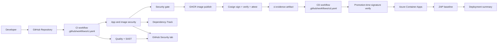

# Architecture Overview

This repository demonstrates a security-first GitHub Actions delivery model for a small ASP.NET Core API.

## System view

## Main building blocks

### Application

- ASP.NET Core API under `src/DevSecOpsPipelineSample.Api`
- xUnit test project under `tests/DevSecOpsPipelineSample.Api.Tests`
- container image built from the repository root `Dockerfile`

### Workflow layer

- `ci.yaml` performs quality validation, SAST, app SCA, image SCA, security gating, publish, signing, attestation, and evidence generation
- `cd.yaml` consumes `ci-evidence`, verifies the published image again, deploys to Azure Container Apps, and runs ZAP baseline
- repo-local composite actions under `.github/actions/` encapsulate repeated setup, scan, and evidence tasks

### Evidence and supply chain layer

- GitHub code scanning receives SARIF outputs from CodeQL, Semgrep, Checkov, Trivy, Grype, and optional Snyk scans
- Dependency-Track receives app and image CycloneDX BOM uploads when configured
- Cosign keyless signing protects SBOM bundles and published images with GitHub OIDC identity
- GitHub attestation records provenance for published images

## Delivery model

1. Developers push code or open a pull request.
2. CI validates code quality before expensive security stages.
3. SAST and misconfiguration scans run in parallel where possible.
4. App and image artifacts are scanned and described with SBOMs.
5. A dedicated security gate prevents publish when required upstream jobs fail.
6. Successful CI produces a `ci-evidence` artifact that becomes the contract for CD.
7. CD promotes only when evidence indicates deploy is enabled and a signed image digest is present.
8. Deployment is followed by a lightweight staged DAST pass.

## Related documents

- [CI/CD Pipeline Guide](ci-cd-pipeline.md)
- [Security Configuration](security-config.md)
- [Project Structure](project-structure.md)
- [GitHub Secrets](github-secrets.md)
