# Architecture Overview

This repository demonstrates a security-first GitHub Actions delivery model for a small ASP.NET Core API.

## System view

```mermaid
flowchart LR
    Dev[Developer] --> Repo[GitHub Repository]
    Repo --> CI[CI workflow\n.github/workflows/ci.yaml]
    CI --> Sec1[Quality + SAST]
    CI --> Sec2[App and image security]
    Sec2 --> Gate[Security gate]
    Gate --> GHCR[GHCR image publish]
    GHCR --> Sign[Cosign sign + verify + attest]
    Sign --> Evidence[ci-evidence artifact]
    Evidence --> CD[CD workflow\n.github/workflows/cd.yaml]
    CD --> Verify[Promotion-time signature verify]
    Verify --> DevDeploy[Auto deploy to dev]
    Verify --> StageDeploy[Auto deploy to staging]
    DevDeploy --> DevTarget[Config-driven deploy target]
    StageDeploy --> StageTarget[Config-driven deploy target]
    DevTarget --> ACADev[Azure Container Apps]
    DevTarget --> AKSDev[AKS direct or Flux]
    StageTarget --> ACAStage[Azure Container Apps]
    StageTarget --> AKSStage[AKS direct or Flux]
    ACADev --> DevChecks[Dev smoke + k6 + ZAP]
    AKSDev --> DevChecks
    DevChecks --> DeployEvidence[Deployment summary]
    ACAStage --> StageChecks[Staging smoke + k6 + ZAP]
    AKSStage --> StageChecks
    StageChecks --> Approval[Manual production approval]
    Approval --> Prod[Production deploy]
    Prod --> ProdChecks[Prod smoke + k6 + ZAP]
    ProdChecks --> DeployEvidence
    Sec2 --> DTrack[Dependency-Track]
    Sec1 --> GHSec[GitHub Security tab]
    Sec2 --> GHSec
```

## Main building blocks

### Application

- ASP.NET Core API under `src/DevSecOpsPipelineSample.Api`
- xUnit unit test project under `tests/DevSecOpsPipelineSample.UnitTests`
- xUnit end-to-end test project under `tests/DevSecOpsPipelineSample.EndToEndTests`
- k6 post-deploy test assets under `tests/DevSecOpsPipelineSample.K6Tests`
- container image built from the repository root `Dockerfile`

### Workflow layer

- `ci.yaml` performs quality validation, SAST, app SCA, image SCA, security gating, publish, signing, attestation, and evidence generation
- `cd.yaml` consumes `ci-evidence`, verifies the published image again, deploys to `dev` or `staging`, runs smoke + k6 + ZAP, then can promote to `production` through a manual GitHub Environment gate
- repo-local composite actions under `.github/actions/` encapsulate repeated setup, scan, and evidence tasks

### Evidence and supply chain layer

- GitHub code scanning receives SARIF outputs from CodeQL, Semgrep, Checkov, Trivy, Grype, and optional Snyk scans
- Dependency-Track receives app and image CycloneDX BOM uploads when configured
- Cosign keyless signing protects SBOM bundles and published images with GitHub OIDC identity
- GitHub attestation records provenance for published images

## Delivery model

1. Developers push code or open a pull request.
2. CI validates code quality before expensive security stages.
3. SAST and misconfiguration scans run in parallel where possible.
4. App and image artifacts are scanned and described with SBOMs.
5. A dedicated security gate prevents publish when required upstream jobs fail.
6. Successful CI produces a `ci-evidence` artifact that becomes the contract for CD.
7. CD promotes only when evidence indicates deploy is enabled and a signed image digest is present.
8. Main branch runs are routed to `dev`, while tag runs are routed to `staging`.
9. Deployment target is selected by environment configuration: Azure Container Apps, AKS direct, or AKS plus Flux.
10. Deployment is followed by target-environment smoke checks, a short k6 pass, and a lightweight ZAP baseline scan.
11. Staging can be promoted to `production` only after successful runtime checks and GitHub Environment approval.

## Related documents

- [CI/CD Pipeline Guide](ci-cd-pipeline.md)
- [Security Configuration](security-config.md)
- [Project Structure](project-structure.md)
- [GitHub Secrets](github-secrets.md)
